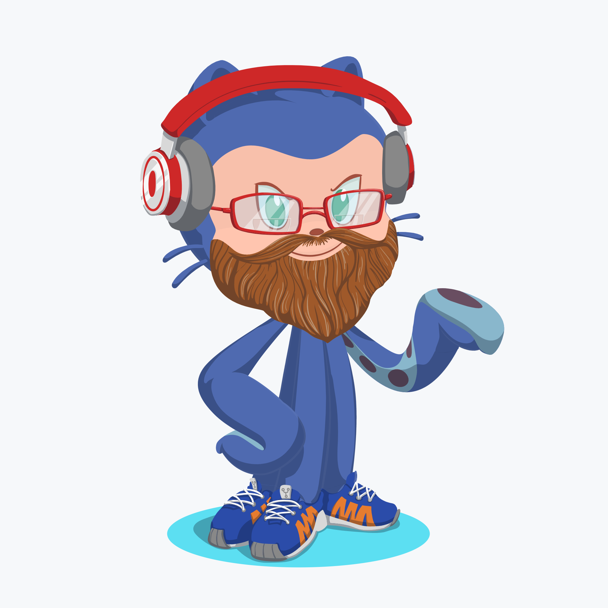

### Welcome 👋

My name is Bob.  I'm married with 2 kids, one daughter and one son.  I'm a principal software engineer for an application security startup in Baltimore, MD 🦀.  I've been working at both software companies and web consulting companies since 2005.  I started my career in QA but after 8 years I was was done with writing code to test code. I wanted to actually ship software that people used. I've held positions as invidual contributors as well as middle management.  I love live music and enjoy attending bluegrass music festivals.

### About Me

 * I'm currently working as a node agent engineer at [Contrast Security](https://www.contrastsecurity.com)
 * I love javascript and have been writing Node.js for 7 years
 * Other Languages I 👍: Python, Bash, Perl, and Go.
 * Language I 👎: Java
 * :twitter: [@bizob2828](https://www.twitter.com/bizob2828)

